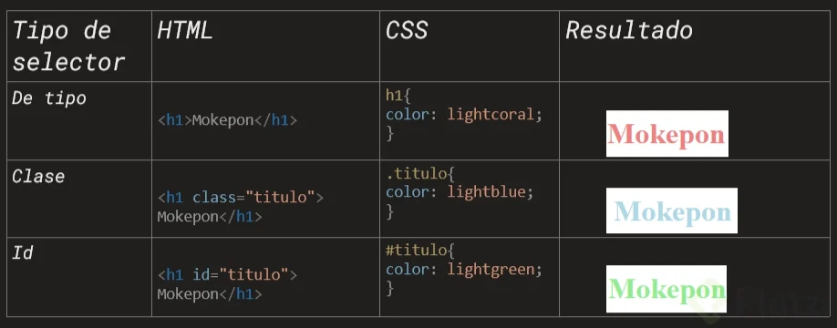
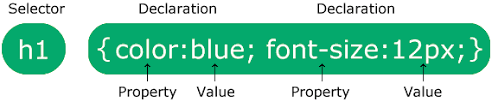
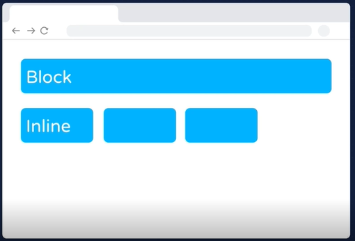
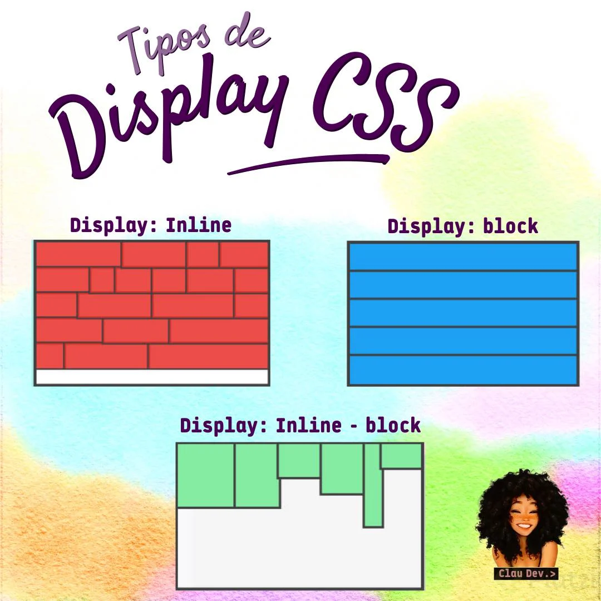
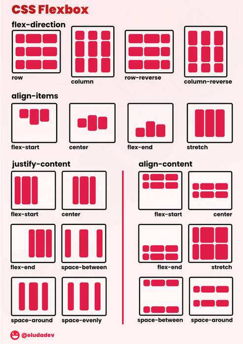
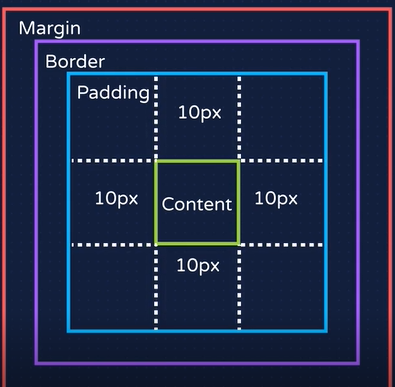

## Variables
- Las variables son como cajas que almacenan información
- Estas variables se guardan en memoria ram que se borra cuando se reinicia y los archivos están en el disco duro de larga duración.

La función se invoca y se ejecutan como el alert()
dentro del parentesis va el parametro el valor que se ejecuta.

Concatenar cuando juntas dos texto

Las funciones se pueden reutilizan muchas veces son partes pequeñas de código. Solo invocar cuando lo necesito

## DOM

El navegador por dentro estructura las etiquetas html para que puedas manipular en código javascript

https://platzi.com/blog/etiquetas-html-debes-conocer/

Manipular le dom 
https://developer.mozilla.org/es/docs/Web/API/Element/innerHTML

## CSS

https://cssreference.io/ 

https://htmlcolorcodes.com/es/

https://css-tricks.com/snippets/css/a-guide-to-flexbox/

https://colorhunt.co/

https://desarrolloweb.com/articulos/que-es-responsive-web-design.html

https://css-tricks.com/snippets/css/complete-guide-grid/#prop-display

https://css-tricks.com/snippets/css/complete-guide-grid/

https://flexboxfroggy.com/#es

https://cssgridgarden.com/#es

